# JP2Forge Advanced Workflow Diagram

This diagram provides a comprehensive view of JP2Forge workflow with all component relationships, including utilities and system resource management. This detailed version is intended for developers and power users who need to understand the complete system architecture.

```mermaid
flowchart TD
    subgraph "User Interface"
        CLI["CLI Interface<br/>(cli/workflow.py)"]
    end
    
    subgraph "Core Components"
        BaseWorkflow["BaseWorkflow<br/>(workflow/base.py)"]
        StandardWorkflow["StandardWorkflow<br/>(workflow/standard.py)"]
        ParallelWorkflow["ParallelWorkflow<br/>(workflow/parallel.py)"]
        Compressor["JPEG2000Compressor<br/>(core/compressor.py)"]
        Analyzer["ImageAnalyzer<br/>(core/analyzer.py)"]
        MetadataHandler["MetadataHandler<br/>(core/metadata)"]
    end
    
    subgraph "Types & Configuration"
        CoreTypes["Core Types<br/>(core/types.py)"]
        WorkflowConfig["WorkflowConfig<br/>(core/types.py)"]
        ConfigManager["ConfigManager<br/>(utils/config/config_manager.py)"]
    end
    
    subgraph "External Dependencies"
        Pillow["Pillow >= 9.0.0<br/>Image Processing, JP2 Encoding"]
        NumPy["NumPy >= 1.20.0<br/>Array Operations, Analysis"]
        Psutil["psutil >= 5.8.0<br/>System Resource Monitoring"]
        Jpylyzer["jpylyzer >= 2.2.0<br/>JPEG2000 Validation"]
        ExifTool["ExifTool<br/>Metadata Management"]
        Kakadu["Kakadu (Optional)<br/>High-Perf JP2, BnF Compliance"]
    end
    
    subgraph "Utilities"
        ImageUtils["Image Utilities<br/>(utils/image.py)"]
        ColorProfiles["Color Profile Handling<br/>(utils/color_profiles.py)"]
        Validation["JP2 Validation<br/>(utils/validation.py)"]
        Profiling["Performance Profiling<br/>(utils/profiling.py)"]
        ResourceMonitor["Resource Monitor<br/>(utils/resource_monitor.py)"]
        IOUtils["IO Utilities<br/>(utils/io.py)"]
        MemoryEstimator["Memory Estimator<br/>(utils/imaging/memory_estimator.py)"]
        StreamingProcessor["Streaming Processor<br/>(utils/imaging/streaming_processor.py)"]
    end
    
    subgraph "Reporting"
        ReportManager["Report Manager<br/>(reporting/reports.py)"]
    end
    
    %% Core connections
    CLI --> BaseWorkflow
    BaseWorkflow --> StandardWorkflow
    BaseWorkflow --> ParallelWorkflow
    StandardWorkflow --> Compressor
    StandardWorkflow --> Analyzer
    StandardWorkflow --> MetadataHandler
    ParallelWorkflow --> Compressor
    ParallelWorkflow --> Analyzer
    ParallelWorkflow --> MetadataHandler
    
    %% Type connections
    CoreTypes --> WorkflowConfig
    WorkflowConfig --> BaseWorkflow
    WorkflowConfig --> ConfigManager
    
    %% Component to external connections
    Compressor --> Pillow
    Compressor --> NumPy
    Compressor --> Kakadu
    
    Analyzer --> Pillow
    Analyzer --> NumPy
    
    MetadataHandler --> ExifTool
    
    CLI --> Jpylyzer
    
    %% Utility connections
    Compressor --> ImageUtils
    Compressor --> ColorProfiles
    
    StandardWorkflow --> Validation
    StandardWorkflow --> Profiling
    ParallelWorkflow --> ResourceMonitor
    ParallelWorkflow --> StreamingProcessor
    
    StandardWorkflow --> IOUtils
    ParallelWorkflow --> IOUtils
    
    Compressor --> MemoryEstimator
    
    %% External dependency connections
    Profiling --> Psutil
    ResourceMonitor --> Psutil
    MemoryEstimator --> Psutil
    StreamingProcessor --> Psutil
    
    %% Reporting connections
    StandardWorkflow --> ReportManager
    ParallelWorkflow --> ReportManager
    CLI --> ReportManager
    
    %% Process Flow
    CLI -.-> |"Step 1: Parse Args & Config"| WorkflowConfig
    WorkflowConfig -.-> |"Step 2: Init Workflow"| StandardWorkflow
    StandardWorkflow -.-> |"Step 3: Process Files"| Compressor
    Compressor -.-> |"Step 4: Analyze Quality"| Analyzer
    Analyzer -.-> |"Step 5: Add Metadata"| MetadataHandler
    MetadataHandler -.-> |"Step 6: Generate Reports"| ReportManager
    ReportManager -.-> |"Step 7: Output"| CLI

classDef core fill:#4caf50,stroke:#e0e0e0,stroke-width:1px,color:#ffffff;
classDef external fill:#03a9f4,stroke:#e0e0e0,stroke-width:1px,color:#ffffff;
classDef utility fill:#ff9800,stroke:#e0e0e0,stroke-width:1px,color:#ffffff;
classDef interface fill:#f44336,stroke:#e0e0e0,stroke-width:1px,color:#ffffff;
classDef config fill:#9c27b0,stroke:#e0e0e0,stroke-width:1px,color:#ffffff;
classDef reporting fill:#795548,stroke:#e0e0e0,stroke-width:1px,color:#ffffff;

class Compressor,Analyzer,MetadataHandler,CoreTypes,BaseWorkflow,StandardWorkflow,ParallelWorkflow core;
class Pillow,NumPy,Psutil,Jpylyzer,ExifTool,Kakadu external;
class ImageUtils,ColorProfiles,Validation,Profiling,ResourceMonitor,IOUtils,MemoryEstimator,StreamingProcessor utility;
class CLI interface;
class WorkflowConfig,ConfigManager config;
class ReportManager reporting;
```

## Advanced Component Details

### Core Components
- **BaseWorkflow**: Abstract base class that defines the common workflow interface and lifecycle methods
- **StandardWorkflow**: Sequential implementation for simple, single-process image processing
- **ParallelWorkflow**: Multi-process implementation using process pools for high-throughput processing
- **Compressor**: Handles JPEG2000 compression with support for multiple encoding backends
- **Analyzer**: Performs quality assessment and validation of compressed images
- **MetadataHandler**: Comprehensive metadata management with XMP and custom embedded metadata

### Resource Management
- **ResourceMonitor**: Dynamically adjusts worker processes based on CPU and memory usage
- **MemoryEstimator**: Calculates memory requirements for image processing operations
- **StreamingProcessor**: Handles large images using tiled processing to reduce memory consumption

### Configuration System
- **WorkflowConfig**: Core configuration data structure with validation
- **ConfigManager**: Handles loading, merging, and validating configuration from multiple sources

### Process Flow Details
1. **Configuration**: CLI arguments are parsed and merged with configuration files
2. **Workflow Initialization**: The appropriate workflow is selected based on configuration
3. **Resource Allocation**: System resources are analyzed to determine optimal processing parameters
4. **Processing**: Images are processed using either standard or parallel workflow
5. **Validation**: Resulting JP2 files are validated against specifications
6. **Metadata Handling**: Technical and descriptive metadata is embedded in the output files
7. **Reporting**: Summary and detailed reports are generated for the batch process

### Advanced Features
- Adaptive resource management for optimal performance
- Dynamic worker pool scaling based on system load
- Streaming processing for memory-efficient handling of large files
- Comprehensive metadata embedding compliant with various standards
- Detailed validation and quality analysis reports
- Support for both Pillow and Kakadu encoding backends