# JP2Forge Workflow Diagram

This diagram provides a high-level overview of the JP2Forge workflow and component relationships.

```mermaid
flowchart TD
    subgraph "User Interface"
        CLI["CLI Interface<br/>(cli/workflow.py)"]
    end
    
    subgraph "Core Components"
        BaseWorkflow["BaseWorkflow<br/>(workflow/base.py)"]
        StandardWorkflow["StandardWorkflow<br/>(workflow/standard.py)"]
        ParallelWorkflow["ParallelWorkflow<br/>(workflow/parallel.py)"]
        Compressor["JPEG2000Compressor<br/>(core/compressor.py)"]
        Analyzer["ImageAnalyzer<br/>(core/analyzer.py)"]
        MetadataHandler["MetadataHandler<br/>(core/metadata)"]
        TIFFHandler["TIFFHandler<br/>Multi-page Processing"]
        
        %% Planned Components (Coming in v1.0.0+)
        BnFValidator["BnF Validator<br/>(Planned v1.0.0)"]
        MetadataFactory["MetadataHandlerFactory<br/>(Planned v1.1.0)"]
        BnFModule["BnF Module<br/>(Planned v1.1.0)"]
        style BnFValidator stroke-dasharray: 5 5
        style MetadataFactory stroke-dasharray: 5 5
        style BnFModule stroke-dasharray: 5 5
    end
    
    subgraph "Types & Configuration"
        CoreTypes["Core Types<br/>(core/types.py)"]
        WorkflowConfig["WorkflowConfig<br/>(core/types.py)"]
    end
    
    subgraph "External Dependencies"
        Pillow["Pillow >= 9.0.0<br/>Image Processing, JP2 Encoding"]
        NumPy["NumPy >= 1.20.0<br/>Array Operations, Analysis"]
        Psutil["psutil >= 5.8.0<br/>System Resource Monitoring"]
        Jpylyzer["jpylyzer >= 2.2.0<br/>JPEG2000 Validation"]
        ExifTool["ExifTool<br/>Metadata Management"]
        Kakadu["Kakadu (Optional)<br/>High-Perf JP2, BnF Compliance"]
    end
    
    subgraph "Utilities"
        ImageUtils["Image Utilities<br/>Format Validation & Transform"]
        ColorProfiles["Color Profile Handling<br/>ICC & Color Space Management"]
        Validation["JP2 Validation<br/>Conformance Checking"]
        Profiling["Performance Profiling<br/>Timing & Memory Analysis"]
        MemoryEfficient["Memory-Efficient Processing<br/>Chunked Operations"]
    end
    
    %% Connections
    CLI --> BaseWorkflow
    BaseWorkflow --> StandardWorkflow
    BaseWorkflow --> ParallelWorkflow
    StandardWorkflow --> Compressor
    StandardWorkflow --> Analyzer
    StandardWorkflow --> MetadataHandler
    StandardWorkflow --> TIFFHandler
    ParallelWorkflow --> Compressor
    ParallelWorkflow --> Analyzer
    ParallelWorkflow --> MetadataHandler
    ParallelWorkflow --> TIFFHandler
    
    CoreTypes --> WorkflowConfig
    WorkflowConfig --> BaseWorkflow
    
    Compressor --> Pillow
    Compressor --> NumPy
    Compressor --> Kakadu
    Compressor --> ImageUtils
    Compressor --> ColorProfiles
    Compressor --> MemoryEfficient
    
    TIFFHandler --> Pillow
    TIFFHandler --> ImageUtils
    TIFFHandler --> MemoryEfficient
    
    Analyzer --> Pillow
    Analyzer --> NumPy
    
    MetadataHandler --> ExifTool
    
    StandardWorkflow --> Validation
    StandardWorkflow --> Profiling
    
    CLI --> Jpylyzer
    
    %% Process Flow
    CLI -.-> |"Step 1: Parse Args & Config"| WorkflowConfig
    WorkflowConfig -.-> |"Step 2: Init Workflow"| StandardWorkflow
    StandardWorkflow -.-> |"Step 2a: Detect Multi-page"| TIFFHandler
    TIFFHandler -.-> |"Step 3: Process Pages"| Compressor
    Compressor -.-> |"Step 4: Analyze Quality"| Analyzer
    Analyzer -.-> |"Step 5: Add Metadata"| MetadataHandler
    MetadataHandler -.-> |"Step 6: Generate Reports"| CLI

classDef core fill:#4caf50,stroke:#e0e0e0,stroke-width:1px,color:#ffffff;
classDef external fill:#03a9f4,stroke:#e0e0e0,stroke-width:1px,color:#ffffff;
classDef utility fill:#ff9800,stroke:#e0e0e0,stroke-width:1px,color:#ffffff;
classDef interface fill:#f44336,stroke:#e0e0e0,stroke-width:1px,color:#ffffff;

class Compressor,Analyzer,MetadataHandler,CoreTypes,TIFFHandler core;
class Pillow,NumPy,Psutil,Jpylyzer,ExifTool,Kakadu external;
class ImageUtils,ColorProfiles,Validation,Profiling,MemoryEfficient utility;
class CLI interface;
```

## Component Overview

### User Interface
- **CLI Interface**: Main entry point for users to interact with JP2Forge

### Core Components
- **BaseWorkflow**: Abstract base class defining workflow interface
- **StandardWorkflow**: Standard sequential processing workflow
- **ParallelWorkflow**: Multi-process parallel workflow for improved performance
- **Compressor**: Handles JPEG2000 compression operations
- **Analyzer**: Analyzes image quality and characteristics
- **MetadataHandler**: Manages metadata embedding and extraction
- **TIFFHandler**: Manages multi-page TIFF detection and page extraction

### External Dependencies
- **Pillow**: Python Imaging Library for basic image operations
- **NumPy**: Numerical processing for analysis operations
- **psutil**: System resource monitoring for performance optimization
- **jpylyzer**: JPEG2000 validation tool
- **ExifTool**: External tool for metadata management
- **Kakadu**: Optional high-performance JP2 codec

### Utilities
- **Image Utilities**: Format validation and transformation
- **Color Profile Handling**: ICC profile and color space management
- **Validation**: JP2 conformance checking
- **Profiling**: Performance timing and analysis
- **Memory-Efficient Processing**: Chunked operations for large images

### Workflow Steps
1. Parse arguments and configuration
2. Initialize appropriate workflow
2a. Detect multi-page TIFF files
3. Process input files and compress to JP2
4. Analyze resulting images for quality
5. Add metadata to JP2 files
6. Generate and output reports