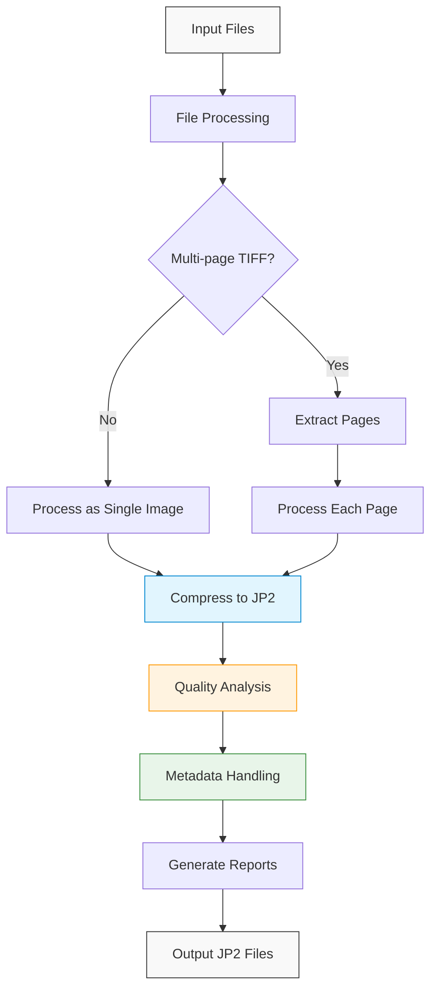
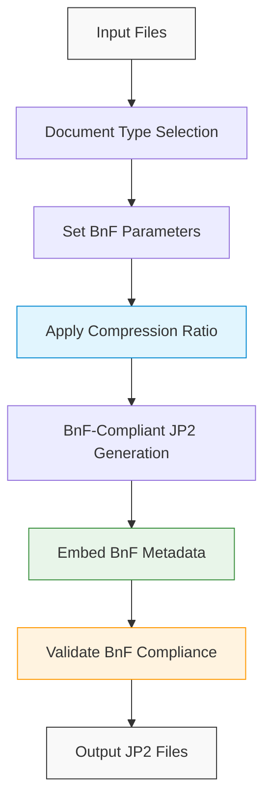
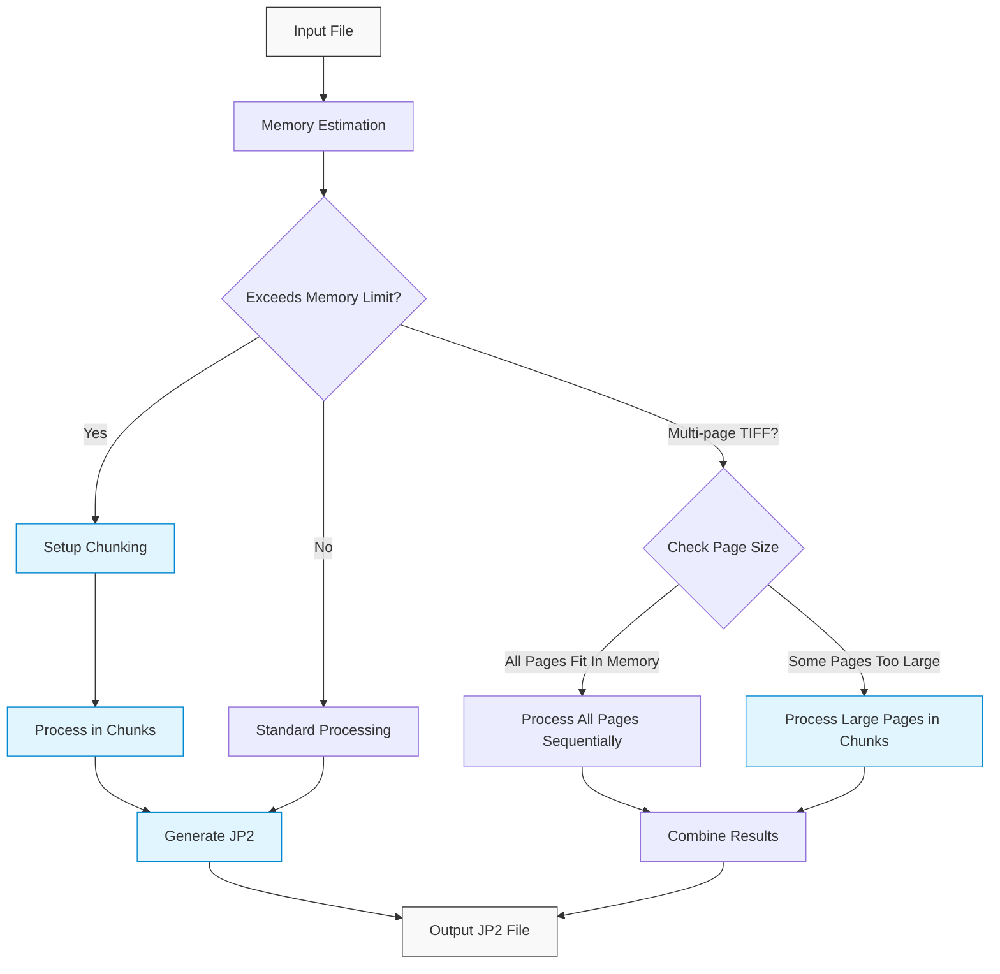
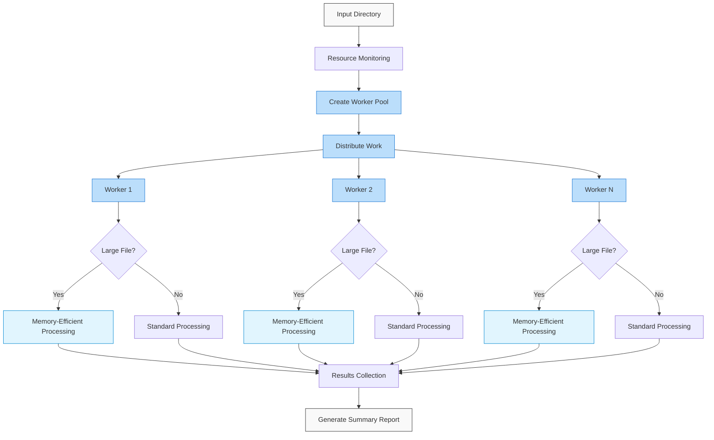

# JP2Forge Visual Workflow

This document provides visual diagrams of the JP2Forge processing workflows.

## Standard Processing Workflow

## BnF Compliance Workflow

## Memory-Efficient Processing

Memory-efficient processing is available in both standard and parallel workflows to handle large images and multi-page TIFFs.

### Memory-Efficient Configuration Options

The memory-efficient processing can be controlled with these configuration parameters:

| Parameter | Description | Default |
|-----------|-------------|---------|
| `--memory-limit-mb` | Maximum memory to use (MB) | 4096 |
| `--chunk-size` | Chunk size in pixels | 1000000 |
| `--force-chunking` | Force chunked processing | False |
| `--min-chunk-height` | Minimum chunk height | 32 |

## Parallel Processing Workflow

