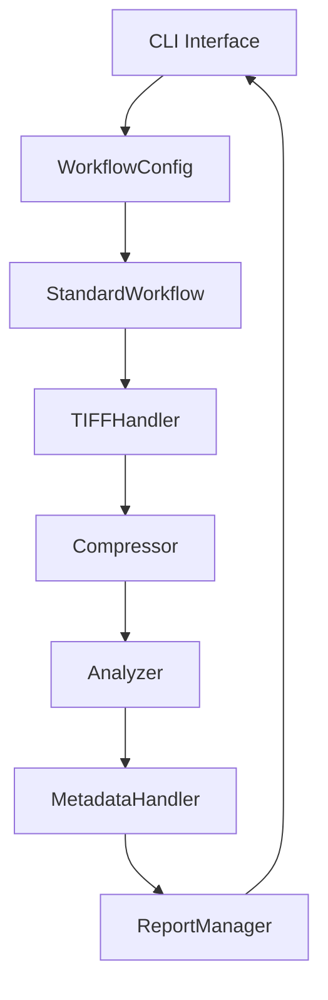

# JP2Forge Workflows

This document provides a consolidated view of JP2Forge workflows.

## Quick Navigation
- [Standard Workflow](#standard-workflow) - Core processing pipeline
- [Advanced Features](#advanced-features) - Memory efficiency and parallel processing
- [Component Reference](#component-reference) - Description of key components

## Standard Workflow

The standard workflow handles the basic image conversion process:

1. **Input Processing**: Parse input files/directories
2. **TIFF Handling**: Detect and extract multi-page TIFFs
3. **Compression**: Convert to JPEG2000 format
4. **Analysis**: Calculate image quality metrics
5. **Metadata**: Add required metadata
6. **Validation**: Validate JP2 compliance
7. **Reporting**: Generate result reports

## Advanced Features

### Memory-Efficient Processing

For large files, JP2Forge uses a streaming approach:

1. **Memory Estimation**: Calculate required memory
2. **Chunking**: Process image in manageable chunks
3. **Streaming**: Stream data to avoid memory overflows

### Parallel Processing

For batch processing, JP2Forge offers parallel execution:

1. **Resource Monitoring**: Track system resources
2. **Adaptive Workers**: Scale worker count based on system load
3. **Work Distribution**: Efficiently distribute work among threads

## Component Reference

| Component | Purpose | Key Features |
|-----------|---------|-------------|
| **CLI Interface** | User interaction | Command parsing, configuration loading |
| **WorkflowConfig** | Configuration | Parameter validation, defaults |
| **StandardWorkflow** | Sequential processing | Single-file operations |
| **ParallelWorkflow** | Multi-threaded processing | Batch operations, resource monitoring |
| **TIFFHandler** | Multi-page processing | Page extraction, metadata preservation |
| **Compressor** | JPEG2000 conversion | Multiple compression modes |
| **Analyzer** | Quality assessment | PSNR, SSIM, MSE calculations |
| **MetadataHandler** | Metadata operations | XMP generation, BnF compliance |
| **ReportManager** | Output generation | File reports, batch summaries |

For the complete technical architecture diagram with all components and connections, see the [Architecture Documentation](architecture.md).