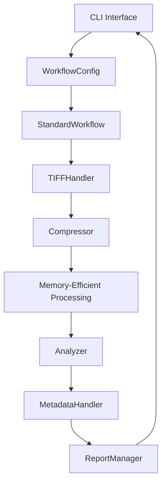
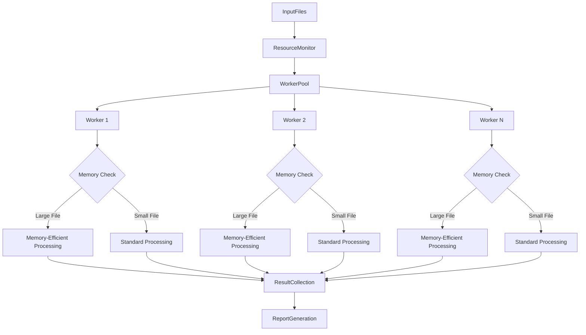

# JP2Forge Workflows

This document provides a consolidated view of JP2Forge workflows.

## Quick Navigation
- [Standard Workflow](#standard-workflow) - Core processing pipeline
- [Advanced Features](#advanced-features) - Memory efficiency and parallel processing
- [Component Reference](#component-reference) - Description of key components

## Standard Workflow

The standard workflow handles the basic image conversion process:

1. **Input Processing**: Parse input files/directories
2. **TIFF Handling**: Detect and extract multi-page TIFFs
3. **Compression**: Convert to JPEG2000 format with memory optimization
4. **Analysis**: Calculate image quality metrics
5. **Metadata**: Add required metadata
6. **Validation**: Validate JP2 compliance
7. **Reporting**: Generate result reports

## Advanced Features

### Memory-Efficient Processing

Memory-efficient processing is available in both standard and parallel workflows:

1. **Memory Estimation**: Calculate memory requirements for image processing
2. **Adaptive Chunking**: Process image in memory-optimized chunks
3. **Multi-page Handling**: Apply memory optimization to individual TIFF pages
4. **Configuration Options**: Control memory usage with parameters

**Key Configuration Parameters:**
- `--memory-limit-mb`: Maximum memory to use (default: 4096 MB)
- `--chunk-size`: Size of image chunks to process (default: 1000000 pixels)
- `--force-chunking`: Force chunked processing for all images
- `--min-chunk-height`: Minimum chunk height for processing (default: 32 pixels)

### Parallel Processing

For batch processing, JP2Forge offers parallel execution with memory optimization:

1. **Resource Monitoring**: Track system resources during processing
2. **Adaptive Workers**: Scale worker count based on system load
3. **Per-Worker Memory Management**: Apply memory-efficient processing in each worker
4. **Work Distribution**: Efficiently distribute and balance work among threads

## Component Reference

| Component | Purpose | Key Features |
|-----------|---------|-------------|
| **CLI Interface** | User interaction | Command parsing, configuration loading |
| **WorkflowConfig** | Configuration | Parameter validation, defaults |
| **StandardWorkflow** | Sequential processing | Single-file operations, multi-page handling |
| **ParallelWorkflow** | Multi-threaded processing | Batch operations, resource monitoring |
| **TIFFHandler** | Multi-page processing | Page extraction, memory-efficient processing |
| **Compressor** | JPEG2000 conversion | Multiple compression modes, chunked processing |
| **MemoryEstimator** | Memory management | Estimate requirements, optimize chunk sizes |
| **Analyzer** | Quality assessment | PSNR, SSIM, MSE calculations |
| **MetadataHandler** | Metadata operations | XMP generation, BnF compliance |
| **ReportManager** | Output generation | File reports, batch summaries |

For detailed visual workflow diagrams, see the [Workflow Diagrams](workflow_diagram.md) document, which includes standard, BnF compliance, memory-efficient, and parallel processing flows.